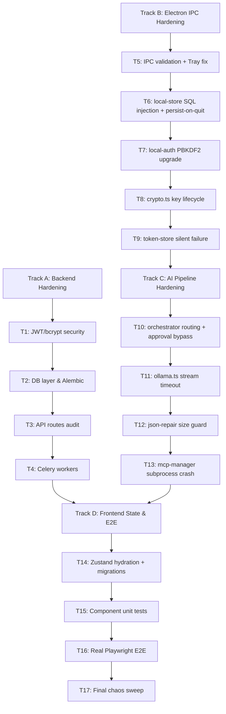

# Implementation Plan — Atlas Apex Quality Audit & Hardening

## Problem Statement

Atlas is a production-grade local-first Electron + Next.js + FastAPI application with an Ollama-backed AI orchestrator, SQLite local storage, OAuth token management, and MCP subprocess servers. The goal is to exhaustively audit every layer — frontend state, Electron IPC, AI pipeline, security, and backend infrastructure — and fortify each with tests and fixes before any production release.

---

## Background (from codebase analysis)

The real stack is:

- **Frontend:** Next.js (App Router) in Electron renderer, Zustand stores (`useChatStore`, `useAuthStore`, `useAppStore`, `useBriefingStore`), Framer Motion animations
- **Electron Main:** IPC handlers in `main.ts`, Orchestrator (LangGraph-style state machine), `MCPServerManager` (child process stdio JSON-RPC), `local-store` (sql.js SQLite), `local-auth` (PBKDF2 + session), `token-store` (AES-256-GCM encrypted JSON), `crypto.ts`, `cloud-sync.ts`
- **AI Pipeline:** `orchestrator.ts` → `intent-classifier.ts` → `mcp-manager.ts` → `ollama.ts` (stream) → `json-repair.ts` → approval gate for destructive tools
- **Backend (Python):** FastAPI with PostgreSQL (SQLAlchemy/Alembic), Neo4j, Qdrant, Redis, Celery workers. Auth via JWT + bcrypt. AES-256-GCM for token-at-rest. Routes: auth, users, gmail, conversations, search, briefing, actions, connectors
- **Existing tests:** Very sparse — 4 backend unit test files, 2 Playwright E2E specs that mock most things, 2 frontend unit tests. The previous "QA sweep" was cosmetic (borders, TODO removal) — no actual test coverage was verified

### Known structural issues identified during review

- `main.ts` has a duplicate `Tray` import (line 9–10)
- `token-store.ts` silently returns `{}` on decryption failure — tokens are lost without user notification
- `local-auth.ts` uses PBKDF2 at only 10,000 iterations (OWASP recommends 600,000+ for SHA-512)
- `crypto.ts` `hashedEmailId` uses only 1,000 PBKDF2 iterations — trivially brute-forceable
- `orchestrator.ts` `TOOL_ROUTING` maps `schedule` to both `list_calendar` AND `create_event` — a readonly intent could accidentally route to a destructive tool
- `local-store.ts` uses `isPersisting`/`pendingPersist` debounce but no queue drain guarantee on `app.quit`
- No IPC input validation — any renderer-injected payload reaches the main process
- MCP subprocess stderr is not captured/logged on all servers, silently swallowing crashes
- `json-repair.ts` truncated-object recovery attempts parsing of incomplete JSON without a size guard (DoS via huge model output)
- E2E tests mock the Ollama endpoint — real integration paths are never tested

---

## Proposed Solution

Organize the work into four domain tracks executed sequentially, each building on the previous. Every task ends with a working, demonstrable, tested increment.

---

## Task Breakdown

### Track A — Backend Hardening (Python/FastAPI)

#### Task 1: Audit and test the JWT + bcrypt security layer

- **Objective:** Verify `security.py` — JWT expiry edge cases, algorithm confusion attack (`none` alg), bcrypt timing safety, token type enforcement (access vs refresh).
- **Implementation:** Read `backend/app/core/security.py` fully, read `backend/app/api/v1/auth.py` fully, read existing `tests/unit/test_security.py`. Write pytest cases for: expired token rejection, `alg=none` rejection, refresh token used as access token rejection, bcrypt timing attack (constant-time verification).
- **Test requirements:** All cases in `tests/unit/test_security.py` must pass with `pytest -v`.
- **Demo:** `pytest backend/tests/unit/test_security.py` exits 0 with 100% of new cases green.

#### Task 2: Audit and test the database layer and Alembic migration

- **Objective:** Verify `database.py` connection pooling, session lifecycle, and `001_initial_schema.py` migration for correctness, missing indexes, and cascade rules.
- **Implementation:** Read `backend/app/infrastructure/database.py`, `alembic/versions/001_initial_schema.py`. Check for: missing `NOT NULL` constraints, missing foreign key indexes, sessions not closed on exception, pool exhaustion under concurrent load. Write tests using `pytest-asyncio` with an in-memory SQLite test DB.
- **Test requirements:** Session cleanup test (no open connections after exception), migration idempotency test (running migration twice doesn't fail).
- **Demo:** `pytest backend/tests/unit/test_database.py` green.

#### Task 3: Audit and test all FastAPI API routes

- **Objective:** Every route in `backend/app/api/v1/__init__.py` must be tested for: unauthenticated rejection (401), malformed input (422), and happy-path response shape.
- **Implementation:** Read `backend/app/api/v1/__init__.py` (25,987 bytes — the main route file), `gmail.py`, `users.py`. Write `tests/integration/test_routes.py` using FastAPI's `TestClient` with a mocked DB session. Cover: missing auth header, invalid JWT, valid request with fixture user.
- **Test requirements:** All routes return documented status codes. No route returns a 500 on malformed input.
- **Demo:** `pytest backend/tests/integration/test_routes.py -v` green.

#### Task 4: Audit and test Celery workers and background tasks

- **Objective:** Verify `sync_tasks.py` and `embedding_tasks.py` for: unhandled exceptions that silently drop tasks, missing retry logic, and database session leaks inside tasks.
- **Implementation:** Read both worker files. Write unit tests mocking Celery beat with `pytest` + `unittest.mock`. Test: task failure → retry, task success → DB commit, concurrent task execution.
- **Test requirements:** No task silently swallows exceptions; all failures are logged and re-raised for Celery's retry mechanism.
- **Demo:** `pytest backend/tests/unit/test_workers.py` green.

---

### Track B — Electron Main Process & IPC Hardening

#### Task 5: Fix duplicate Tray import and audit all IPC handlers in `main.ts`

- **Objective:** Remove the duplicate `Tray` import. Enumerate every `ipcMain.handle()` call and verify: (a) input is validated/sanitized before use, (b) errors are caught and returned as structured IPC errors (not crashes), (c) no handler leaks memory by registering listeners inside a loop.
- **Implementation:** Read `main.ts` fully. Map all IPC channels. Add Zod or manual schema validation at each handler boundary. Write Jest unit tests for IPC handler logic extracted into pure functions.
- **Test requirements:** Test that a handler receiving `null`, `undefined`, or an oversized payload returns a graceful error rather than throwing.
- **Demo:** `npm test` in `frontend/` shows IPC handler tests passing.

#### Task 6: Harden `local-store.ts` — write-queue drain, crash recovery, and SQL injection audit

- **Objective:** Guarantee `forcePersist()` is called before `app.quit`. Audit every `db.run()` call for string-interpolated SQL (injection risk). Verify the LRU cache is invalidated on writes.
- **Implementation:** Read `local-store.ts` fully. Enumerate all `db.run()` calls. Parameterize any that interpolate variables. Register `app.on('before-quit')` hook to drain the persist queue synchronously. Write tests: inject a payload with `'; DROP TABLE messages; --` as a conversation title and verify it is stored safely.
- **Test requirements:** SQL injection test must show the string is stored literally, not executed. Persist-on-quit test must verify the file is written before exit.
- **Demo:** Test suite green; DB file integrity verified after simulated abrupt quit.

#### Task 7: Harden `local-auth.ts` — PBKDF2 iteration count and session fixation

- **Objective:** Raise PBKDF2 iterations from 10,000 to 600,000 (OWASP PBKDF2-HMAC-SHA512 recommendation). Verify sessions are regenerated on login and invalidated on logout. Add a migration path for existing users.
- **Implementation:** Read `local-auth.ts` fully. Update `PBKDF2_ITERATIONS`. Write a migration that re-hashes on next login (compare old hash, re-derive and update). Write tests: verify old iteration-count hashes are upgraded, verify session token changes after login.
- **Test requirements:** New password hash must not verify against old iteration count. Session token before and after login must differ.
- **Demo:** `npm test` passes all auth tests; existing test user can still log in after migration.

#### Task 8: Harden `crypto.ts` — fix the 1,000-iteration `hashedEmailId` and verify AES-GCM key lifecycle

- **Objective:** `getHashedEmailId()` uses 1,000 PBKDF2 iterations with a static salt — this is trivially brute-forceable. Raise to a minimum of 100,000 iterations with a random salt stored alongside the hash. Verify that `globalEncryptionKey` is zeroed on logout (`clearKeys()`).
- **Implementation:** Read `crypto.ts` fully, read `token-store.ts` fully. Verify `clearKeys()` is called in `authLogout`. Write tests: verify key is cleared after logout, verify `encryptData`/`decryptData` round-trip, verify tampered ciphertext throws rather than returning garbage.
- **Test requirements:** Authentication tag verification test (tampered byte → throws). Key-zeroing test (key is empty string after logout).
- **Demo:** `npm test` passes all crypto tests.

#### Task 9: Harden `token-store.ts` — silent decryption failure and token loss

- **Objective:** `readStore()` currently returns `{}` silently when decryption fails — the user's tokens are irrecoverably lost with no indication. Add: user-facing error surfaced via IPC, write a corrupted-store backup before attempting recovery, log the error with a fingerprint (not the key).
- **Implementation:** Read `token-store.ts` fully. Replace silent `return {}` with a recoverable error path that: copies the file to `token-store.json.corrupted`, emits an IPC event to the renderer to notify the user, returns `{}`. Write tests: simulate corrupted file → verify backup created → verify IPC event fired → verify `{}` returned (no crash).
- **Test requirements:** Corrupted token store must never cause a silent data loss; user must always be notified.
- **Demo:** Inject a corrupted token file; verify backup and IPC notification appear.

---

### Track C — AI Pipeline & Orchestrator Hardening

#### Task 10: Audit and fix `orchestrator.ts` — TOOL_ROUTING ambiguity and approval gate bypass

- **Objective:** The `schedule` keyword routes to both `list_calendar` (readonly) AND `create_event` (destructive). This means a read intent ("show my schedule") could trigger an approval gate. Fix by splitting routing: readonly intents only receive readonly tools. Also verify the approval gate cannot be bypassed by replaying an old `executionId`.
- **Implementation:** Read `orchestrator.ts` fully (78KB). Map every `TOOL_ROUTING` entry against `READONLY_TOOLS` and `DESTRUCTIVE_TOOLS`. Fix ambiguous entries. Add `executionId` expiry (TTL of 5 minutes in `pendingApprovals` map). Write unit tests for each ambiguous routing path.
- **Test requirements:** "show my schedule" must never trigger an approval gate. A replayed approval `executionId` after TTL must be rejected.
- **Demo:** `npm test` passes routing and approval-gate tests.

#### Task 11: Harden `ollama.ts` — stream timeout, abort signal, and model-not-found handling

- **Objective:** Verify every `fetch()` call has an `AbortController` timeout. Verify model-not-found (404 from Ollama) is surfaced as a user-friendly error, not a crash. Verify the stream reader loop cannot hang indefinitely.
- **Implementation:** Read `ollama.ts` fully. Add `AbortController` with configurable timeout (default 60s) to `streamChat`. Add explicit 404 handling. Write tests: mock `fetch` to return 404 → verify error message; mock `fetch` to hang → verify timeout fires; mock mid-stream disconnect → verify partial content is returned and state is clean.
- **Test requirements:** No uncaught promise rejections from any Ollama failure mode.
- **Demo:** All three chaos scenarios pass in `npm test`.

#### Task 12: Harden `json-repair.ts` — size guard and nested structure depth limit

- **Objective:** A very large LLM output (e.g., 10MB of repeated JSON) passed to `repairAndParseJson` will attempt to parse it all, potentially causing a hang. Add a `MAX_INPUT_SIZE` guard (e.g., 512KB) and a structural depth limit.
- **Implementation:** Read `json-repair.ts` fully. Add `if (input.length > MAX_INPUT_SIZE) throw new Error(...)` guard at function entry. Write tests: pass a 1MB string → verify throws immediately; pass valid 10-char JSON → verify parses correctly.
- **Test requirements:** Size guard test must show the function throws within 1ms on oversized input.
- **Demo:** `npm test` passes size guard and parse tests.

#### Task 13: Harden `mcp-manager.ts` — subprocess crash capture, request timeout, and restart storm prevention

- **Objective:** MCP subprocess stderr is not uniformly captured. Pending RPC requests have timeouts but no guarantee they are cleaned up if the process dies mid-request. Restart logic has `restartCount` but no exponential backoff. Fix all three.
- **Implementation:** Read `mcp-manager.ts` fully. Wire `stderr` event handler to log output for every spawned process. In `process.on('exit')`, reject all pending requests for that server with a structured error. Replace linear restart with exponential backoff (1s, 2s, 4s … cap 60s). Write tests: mock a process that exits mid-RPC → verify pending request rejects cleanly; simulate 5 rapid restarts → verify backoff timing.
- **Test requirements:** Zero hanging promises when a subprocess dies. Restart storm test must show 5 restarts take at least 1+2+4+8+16=31s total.
- **Demo:** `npm test` passes both chaos scenarios.

---

### Track D — Frontend State & E2E Hardening

#### Task 14: Audit Zustand stores for hydration mismatches and stale closures

- **Objective:** `useChatStore` uses `zustand/persist` — verify the rehydrated shape matches the runtime schema (adding a new field without a migration version causes silent `undefined` bugs). Verify no stale closure captures old state in async callbacks.
- **Implementation:** Read all four store files fully. Verify `persist` middleware has a `version` and `migrate` function. Audit all `set()` calls that use the previous state inside an async callback (stale closure pattern). Write Vitest unit tests for store migrations: simulate an old schema → verify migration produces expected new schema.
- **Test requirements:** A store hydrated from a v0 schema must produce a valid v1 object, not crash.
- **Demo:** `npm test` passes store migration tests.

#### Task 15: Write missing component unit tests for critical UI paths

- **Objective:** The components directory (`ui/`, `composite/`, `layout/`) has zero test files. Write React Testing Library tests for: the chat input component (empty submit, max-length, paste, Enter key), the approval gate modal (approve/reject callbacks), the settings page integration toggle (enabled/disabled state).
- **Implementation:** Read key component files under `src/components/`. Write `src/__tests__/ChatInput.test.tsx`, `ApprovalModal.test.tsx`, `SettingsIntegration.test.tsx` using React Testing Library + Jest.
- **Test requirements:** All tests must pass in `npm test`. No component test may use snapshots alone — must assert behavior.
- **Demo:** `npm test` shows 3 new passing test suites.

#### Task 16: Write real (non-mocked) E2E integration tests using Playwright

- **Objective:** The existing Playwright tests mock Ollama and the auth session — they test nothing real. Write tests that: (a) verify the app launches and reaches the login screen, (b) verify the Ollama offline banner appears when port 11434 is unreachable, (c) verify a user can register, log in, and see the dashboard.
- **Implementation:** Read `playwright.config.ts` and existing `tests/e2e/` specs. Extend `happy-path.spec.ts` to test the real Electron IPC flow using `electron-playwright-helpers` or direct `BrowserWindow` testing. Add `offline.spec.ts` for the Ollama-down scenario.
- **Test requirements:** Tests must run against the real built app (not mocked API routes). Ollama-offline test must verify the UI shows the correct error state, not a blank screen.
- **Demo:** `npx playwright test` completes with all tests green on a machine where Ollama is not running.

#### Task 17: Final chaos sweep — concurrent operations and race condition validation

- **Objective:** Test the system under simultaneous stress: (a) user sends 5 chat messages in rapid succession (race condition in `useChatStore` conversation creation), (b) user logs out while an Ollama stream is in-flight (orphaned stream / state leak), (c) SQLite write triggered while persist is already in-flight (queue collision in `local-store.ts`).
- **Implementation:** Write a Vitest test that dispatches 5 concurrent `sendMessage` actions and verifies conversation state is consistent. Write an Electron integration test that starts a stream, fires logout, and verifies no IPC errors or state leaks. Write a local-store stress test with 20 concurrent writes.
- **Test requirements:** Zero race conditions. Zero orphaned streams. Zero DB corruption.
- **Demo:** All three chaos tests pass; heap snapshot shows no memory growth after 10 send-logout cycles.

---

## Dependency Graph

